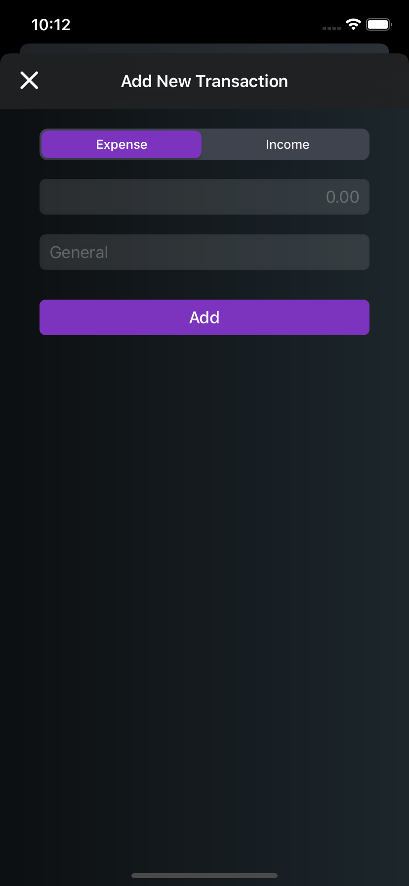

# Spendy
Spendy is a simple expense/income tracking application that shows the implementation of Core Data.

# What I Learned

- CoreData (Entities, Attributes, Relationships)
- Practice using UITableView
- Update UI with data
- Design a UI using auto layout and storyboard

# Screenshots

   

  

